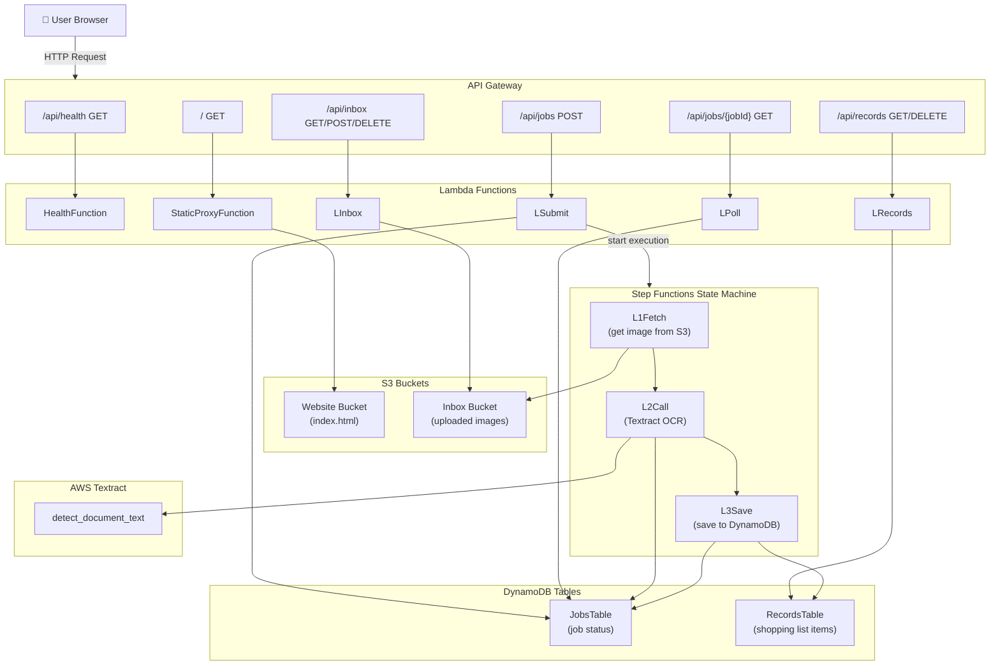

# CMSC471 Architecture Diagram

```mermaid
flowchart TD
    User["👤 User Browser"]
    
    subgraph API["API Gateway"]
        direction TB
        A1["/api/health GET"]
        A2["/api/inbox GET/POST/DELETE"]
        A3["/api/jobs POST"]
        A4["/api/jobs/{jobId} GET"]
        A5["/api/records GET/DELETE"]
        A6["/ GET"]
    end

    subgraph S3["S3 Buckets"]
        B1["Website Bucket\n(index.html)"]
        B2["Inbox Bucket\n(uploaded images)"]
    end

    subgraph Lambdas["Lambda Functions"]
        L1["HealthFunction"]
        L2["StaticProxyFunction"]
        L3["LInbox"]
        L4["LSubmit"]
        L5["LPoll"]
        L6["LRecords"]
    end

    subgraph StateMachine["Step Functions State Machine"]
        SM1["L1Fetch\n(get image from S3)"]
        SM2["L2Call\n(Textract OCR)"]
        SM3["L3Save\n(save to DynamoDB)"]
        SM1 --> SM2 --> SM3
    end

    subgraph DynamoDB["DynamoDB Tables"]
        D1["JobsTable\n(job status)"]
        D2["RecordsTable\n(shopping list items)"]
    end

    subgraph Textract["AWS Textract"]
        T1["detect_document_text"]
    end

    User -->|"HTTP Request"| API
    A6 --> L2 --> B1
    A1 --> L1
    A2 --> L3 --> B2
    A3 --> L4 --> D1
    L4 -->|"start execution"| StateMachine
    A4 --> L5 --> D1
    A5 --> L6 --> D2
    SM1 --> B2
    SM2 --> T1
    SM2 --> D1
    SM3 --> D2
    SM3 --> D1
```